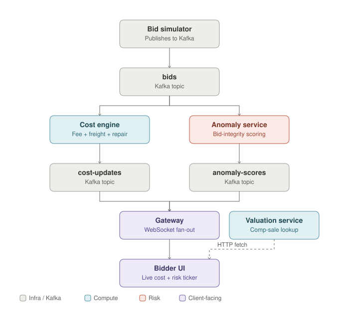

# TrueBid — Real-Time Auction Intelligence for Total Landed Cost & Risk

**What if a bidder could see the real cost and risk of a vehicle before placing the next bid—not after winning the auction?**

TrueBid is a distributed auction-intelligence platform that continuously transforms live bid events into:

- **Total landed cost estimates**
- **Buyer fee calculations**
- **Freight estimates**
- **Repair-cost ranges**
- **Comparable-sale valuations**
- **Bid-integrity and anomaly signals**
- **Real-time bidder-facing updates**

The system is designed around a practical gap in vehicle-auction workflows: the winning bid is only one component of the eventual purchase cost. Fees, transportation, repairs, and uncertainty can materially change whether a vehicle is actually a good deal.

TrueBid explores the layer that sits on top of an existing auction platform: **real-time cost transparency and risk confidence at the moment a bidder decides how much to bid.**

## Why This Project Exists

Vehicle auction platforms provide the core auction workflow: listings, bidding, vehicle information, and auction execution.

However, the bidder's actual financial decision is more complicated:

```
Current Bid
    │
    ├── Buyer Fees
    │
    ├── Transportation
    │
    ├── Expected Repair Cost
    │
    ├── Vehicle Valuation
    │
    └── Risk / Anomaly Signals
         │
         ▼
   Total Decision Cost
```

The key problem is that these calculations are often fragmented across auction pages, fee tables, transport providers, repair estimates, valuation tools, and third-party calculators.

TrueBid brings those signals together and recomputes them continuously as the auction changes.

### The core product idea

**Do not show the bidder only the current price. Show the evolving financial and risk picture behind that price.**

## What This Demonstrates

TrueBid is intentionally built to demonstrate several areas of production-oriented software engineering:

### Distributed Systems

- Kafka event streaming
- Independent services with explicit responsibilities
- Event-driven recomputation
- Consumer groups
- Graceful degradation when dependencies are unavailable

### Backend Engineering

- TypeScript in strict mode
- Express HTTP services
- WebSocket fan-out
- PostgreSQL persistence
- Redis-backed rolling statistics
- Service-specific compilation and runtime boundaries
- JWT authentication and token-bucket rate limiting (HTTP + WebSocket)

### Observability

- Structured JSON logging across all 5 services
- Prometheus metrics (`/metrics`) with a live Grafana dashboard
- Distributed tracing (OpenTelemetry → Jaeger) across the async Kafka boundary that this system's whole story runs through
- Liveness/readiness endpoints reflecting each service's actual dependencies

### Applied Machine Learning

- Explainable weighted KNN comparable-sale valuation
- Confidence-banded estimates
- Regression-based freight fallback
- Streaming statistical anomaly detection
- Cold-start-safe behavior

### Product Judgment

- Confidence ranges instead of false-precision numbers
- Explicit uncertainty explanations
- Real-time recomputation instead of post-auction calculation
- Graceful degradation instead of blank results
- A bidder-focused decision interface rather than a generic dashboard

## Architecture



### Service Responsibilities

| Service | Responsibility | Key Design Decision |
| --- | --- | --- |
| `bid-stream-consumer` | Simulates an upstream live bid feed and publishes bid events to Kafka | Replaceable event-source boundary for a real auction integration |
| `cost-engine` | Calculates buyer fees, freight, repair-cost ranges, and total landed cost | Always returns a usable estimate through fallback strategies |
| `valuation-service` | Estimates vehicle value from historical comparable sales | Explainable weighted KNN instead of an opaque black-box model |
| `anomaly-service` | Detects unusual bid velocity and cross-lot bidding patterns | Statistical baseline before more complex ML |
| `gateway` | Aggregates real-time updates and broadcasts them to bidder clients | One Kafka consumer group regardless of the number of connected viewers |

## Event Flow

A simplified bid-processing flow looks like this:

```
┌─────────────────────┐
│  Bid Stream Source  │
│   (Demo Simulator)  │
└──────────┬──────────┘
           │
           ▼
      ┌─────────┐
      │  Kafka  │
      └────┬────┘
           │
     ┌─────┼──────────────┬─────────────────┐
     │     │              │                 │
     ▼     ▼              ▼                 ▼
 Cost   Anomaly      Gateway          Other Consumers
Engine  Service      Consumer          (Future)
     │     │              │
     │     │              ▼
     │     │        ┌───────────┐
     │     │        │ WebSocket │
     │     │        │  Clients  │
     │     │        └───────────┘
     │     │
     │     └──► Risk / anomaly events
     │
     └────────► Cost estimate events
```

The bidder-facing view is continuously updated as new bid events and derived intelligence arrive.

## Technology Stack

| Layer | Technology |
| --- | --- |
| Runtime | Node.js 20 |
| Language | TypeScript |
| HTTP | Express |
| WebSockets | ws |
| Event Streaming | Apache Kafka (KRaft mode) + KafkaJS |
| Database | PostgreSQL |
| Cache / Statistics | Redis + ioredis |
| Containers | Docker + Docker Compose |
| Frontend | Plain HTML, CSS, and JavaScript |

Each service has its own `tsconfig.json` and compiles independently.

This is intentional. A shared monorepo TypeScript configuration would create unnecessary coupling between independently deployable services.

## Core Design Decisions

### 1. Recompute on the Stream, Not on Page Load

A post-auction calculator answers:

> "What did this vehicle cost?"

TrueBid is designed to answer:

**"What is this vehicle likely to cost if I bid again right now?"**

Every relevant bid event can trigger recalculation of:

```
Bid Amount
    │
    ▼
Buyer Fees
    │
    ▼
Freight Estimate
    │
    ▼
Repair-Cost Range
    │
    ▼
Total Landed Cost
    │
    ▼
Bidder-Facing Update
```

The system therefore treats the bid stream as the source of continuous state change.

### 2. Confidence Bands Instead of False Precision

A repair estimate such as:

> Repair Cost: $4,732.18

can imply a level of certainty that the available data does not justify.

TrueBid instead represents uncertainty explicitly:

```
Estimated Repair Cost

$3,800 ───────── $6,200
          72% confidence
```

The system can also explain why confidence is reduced:

- Incomplete photo-angle coverage
- Thin comparable-sale set
- Missing vehicle attributes
- Limited historical data
- Fallback estimation path

The objective is not to pretend uncertainty does not exist.

The objective is to make uncertainty useful for decision-making.

### 3. Graceful Degradation

A live auction experience should not collapse because a non-critical dependency is temporarily unavailable.

Examples:

**Freight API unavailable**

```
Carrier API
     │
     ├── Available ──► Carrier Estimate
     │
     └── Unavailable ─► Regression Fallback
```

**Too few comparable vehicles**

```
Strict Comparable Search
          │
          ├── Enough Comps ──► High-Confidence Estimate
          │
          └── Too Few Comps ─► Wider Search / Lower Confidence
```

The system prefers:

**A clearly marked lower-confidence estimate**

over:

**No estimate at all**

## Service Details

### bid-stream-consumer

The current implementation simulates an upstream live auction event source.

It publishes bid events to Kafka so that the rest of the system behaves as if it were connected to an existing auction platform.

This is an intentional integration boundary:

Current Demo:

```
Bid Simulator ──► Kafka ──► TrueBid Services
```

Future Integration:

```
Auction Platform ──► Adapter ──► Kafka ──► TrueBid Services
```

The downstream services do not need to change when the demo simulator is replaced with a real event adapter.

### cost-engine

The cost engine calculates the current financial picture of a lot.

Conceptually:

```
Total Landed Cost =
    Winning Bid
  + Buyer Fees
  + Freight
  + Estimated Repair Cost
```

The service includes:

- Tiered buyer-fee calculations
- Freight estimation
- Regression fallback
- Repair-cost ranges
- Confidence scoring
- Photo-signal integration
- Cost-stack event generation

The objective is not simply to calculate a number.

The objective is to produce a number that is:

- available,
- explainable,
- confidence-aware,
- and updated as the bid changes.

### valuation-service

The valuation service estimates comparable-sale value using weighted KNN over historical sales.

The model considers attributes such as:

- Make
- Model
- Model year
- Mileage
- Damage severity
- Title type
- Region

The system intentionally favors an explainable model:

```
Vehicle
   │
   ▼
Find Comparable Sales
   │
   ▼
Score Similarity
   │
   ▼
Weight Comparable Results
   │
   ▼
Estimate Value Range
   │
   ▼
Calculate Confidence
```

This makes the result easier to inspect and explain than a black-box prediction.

### anomaly-service

The anomaly service detects unusual bidding behavior using statistical signals.

Current signals include:

- Bid velocity
- Rolling statistics
- Cross-lot patterns
- Z-score-based deviation

Redis is used for rolling statistics and short-lived state.

The design deliberately starts with an explainable statistical baseline before introducing more complex machine-learning models.

This makes it easier to:

- understand false positives,
- tune thresholds,
- handle cold starts,
- and explain a risk signal to a user.

### gateway

The gateway provides the real-time bidder-facing interface.

Clients log in first (a simulated hand-off from the real auction platform's existing session — see `services/gateway/src/auth.ts`) and then connect through WebSockets with the resulting token:

```
ws://localhost:8000/ws/LOT-1001?token=<jwt>
```

The gateway also proxies `GET /valuation/:lotId` (auth-required) to `valuation-service`, so the frontend never has to call that service's own host port directly and bypass auth. Both the login and valuation endpoints, along with the WebSocket upgrade itself, are behind rate limiting — HTTP requests via `express-rate-limit`, WebSocket connection attempts via a hand-rolled token bucket keyed by `bidder_id` rather than IP. See [`docs/PRODUCTION_READINESS.md`](docs/PRODUCTION_READINESS.md) for exactly what's real versus intentionally simulated in this layer.

The gateway consumes derived events and broadcasts updates to connected clients.

The architecture uses a single Kafka consumer group for the gateway rather than creating one Kafka consumer per connected browser.

This separates:

```
Kafka Consumption
        │
        ▼
Gateway Event Processing
        │
        ▼
Many WebSocket Clients
```

from:

```
One Browser
        │
        ▼
One Kafka Consumer
```

which would not scale appropriately.

## Frontend

The frontend is intentionally implemented as a single HTML/CSS/JavaScript application.

This is a deliberate portfolio and product decision.

The interface is designed as a **decision terminal**, not a marketing dashboard.

The live view displays:

- Current bid
- Total landed cost
- Cost-stack breakdown
- Bid-integrity signal
- Comparable-sale valuation
- Confidence information
- Live updates from the backend

The central visual element is the proportional cost-stack bar:

```
┌──────────────┬────────┬──────────┬─────────┐
│     Bid      │  Fees  │ Freight  │ Repair  │
└──────────────┴────────┴──────────┴─────────┘
```

This allows a bidder to understand not only:

**"What is the total?"**

but also:

**"What is driving the total?"**

The frontend is fully working end-to-end against the local Docker Compose stack, including logging in and authenticating its WebSocket connection like a real bidder session (see the `gateway` section above).

If the backend is unavailable, it also supports a local simulation fallback so the interface remains viewable for portfolio demonstrations.

The pure logic behind all of this — dollar formatting, the cost-stack bar's percentage math, risk labeling, the demo-mode fallback formulas, and the auth-wiring helpers that thread a token into the WebSocket URL — is extracted into `frontend/calc.js` and covered by 23 unit tests (`frontend/test/unit/calc.test.js`), rather than living untestable inside `index.html`'s inline `<script>`. No build step or bundler: it's loaded as a native ES module.

## Quick Start

### Requirements

Install:

- Docker
- Docker Compose

The project is designed to run locally using Docker Compose.

### Start the Full System

```bash
docker compose up --build
```

This starts:

- Kafka (KRaft mode — no separate Zookeeper container)
- Jaeger (distributed tracing UI + OTLP receiver)
- PostgreSQL
- Redis
- Bid event source
- Cost engine
- Valuation service
- Anomaly service
- WebSocket gateway (JWT auth + rate limiting)
- Prometheus (scrapes all 5 services' `/metrics`)
- Grafana (pre-provisioned dashboard, `admin`/`admin`)

PostgreSQL automatically initializes the schema and seed data on first boot.

The demo begins generating bid traffic for:

```
LOT-1001
```

### Open the Frontend

Open:

```
frontend/index.html
```

in a browser.

The frontend connects to:

```
ws://localhost:8000/ws/LOT-1001
```

and displays the live system state.

### Useful Endpoints

**Log In (demo bidder session)**

```
POST http://localhost:8000/auth/login
Content-Type: application/json

{"bidder_id": "demo-viewer"}
```

Returns a JWT. This simulates the hand-off TrueBid would get from the real auction platform's existing session layer — see [`docs/PRODUCTION_READINESS.md`](docs/PRODUCTION_READINESS.md) for what's real vs. intentionally simulated. The frontend logs itself in automatically; this is only needed if you're calling the API directly.

**Cost Estimate**

```
GET http://localhost:8001/estimate/LOT-1001?bid_amount=3200
```

**Comparable Valuation (through the gateway, authenticated)**

```
GET http://localhost:8000/valuation/LOT-1001
Authorization: Bearer <token from /auth/login>
```

`valuation-service`'s own host port (`8002`) still works directly too, for local dev/testing convenience — but it bypasses auth entirely, so it's not the path a real bidder's browser takes. See `docker-compose.yml`'s comment on that port.

**WebSocket Live Feed (authenticated)**

```
ws://localhost:8000/ws/LOT-1001?token=<token from /auth/login>
```

Browsers can't set custom headers during a WS handshake, so the token travels as a query param.

**Health and Readiness**

Every service exposes `GET /healthz` (liveness) and `GET /readyz`
(readiness - checks that service's actual dependencies, e.g. Postgres,
Kafka, Redis). For example:

```
GET http://localhost:8000/readyz   # gateway
GET http://localhost:8001/readyz   # cost-engine
GET http://localhost:8002/readyz   # valuation-service
```

See [`docs/TESTING.md`](docs/TESTING.md#health-and-readiness-endpoints) for exactly what each service's `/readyz` checks and why.

**Metrics, dashboards, and traces**

Every service exposes `GET /metrics` in Prometheus text format (bids processed, cost-calculation duration, valuation requests, anomaly scores, WebSocket client counts, Kafka consumer lag, Postgres query duration, Redis latency, plus free process-level metrics). These are actually scraped and visualized, not just exposed:

```
GET http://localhost:8000/metrics   # gateway (also 8001, 8002, and internally on anomaly-service/bid-stream-consumer)
http://localhost:9090               # Prometheus UI
http://localhost:3000               # Grafana — pre-provisioned "TrueBid — Service Overview" dashboard, admin/admin
http://localhost:16686              # Jaeger UI — a single bid tick traced across all 5 services
```

See [`docs/TESTING.md`](docs/TESTING.md#metrics) for the full list of what each service tracks.

### View Service Logs

```bash
docker compose logs -f cost-engine
docker compose logs -f anomaly-service
docker compose logs -f gateway
docker compose logs -f bid-stream-consumer
```

## Historical Sales Data

The demo includes 800 synthetic historical sales records across 10 make/model combinations.

The seed data is generated by:

```
db/generate-seed.ts
```

and stored in:

```
db/002_historical_sales_seed.sql
```

The schema and seed files are executed automatically by PostgreSQL in numeric filename order.

### The synthetic data includes an explicit pricing model

**Age Depreciation**

Vehicles lose value over time using compounding annual retention.

Luxury vehicles use a different depreciation profile.

**Mileage Penalty**

Mileage above expected annual usage receives a stronger penalty than the benefit provided by below-average mileage.

**Damage Severity**

Values are adjusted based on:

- Low
- Medium
- High

damage severity.

**Title Type**

The data includes:

- Salvage
- Rebuilt
- Non-repairable
- Clean

title categories with different value adjustments.

**Region and Auction Noise**

Regional demand multipliers and random auction-day noise make comparable sales imperfect rather than identical.

This is intentional.

The data is synthetic, but it is generated from an explicit pricing model rather than random numbers.

### Demo Lot

The default demo lot is:

```
LOT-1001
```

Example:

```
2021 Ford Mustang
Front-End Damage
Medium Severity
Salvage Title
```

The seed data contains 12 exact-profile comparable vehicles for this lot.

That is above the service's:

```
MIN_COMPS_FOR_HIGH_CONFIDENCE = 8
```

threshold.

Therefore, the default demo exercises the high-confidence valuation path.

## Testing and Verification

[](https://github.com/<owner>/<repo>/actions/workflows/ci.yml)

*(replace `<owner>/<repo>` above with this repo's actual GitHub path once it's pushed - the workflow itself, `.github/workflows/ci.yml`, needs no changes.)*

Every push and pull request against `main` runs the full suite in GitHub Actions across three tiers: type-checking + unit tests (fast, every service), integration tests (mocked infra plus real Postgres/Redis/Kafka via testcontainers, using the runner's built-in Docker daemon), and an end-to-end smoke test against the actual `docker compose up` stack. See [`docs/TESTING.md#continuous-integration`](docs/TESTING.md#continuous-integration) for the full breakdown.

The project includes automated testing around the core domain and infrastructure behavior.

The test strategy covers areas such as:

- Cost calculation rules
- Buyer-fee tiers
- Freight fallback behavior
- Repair-cost estimation
- Comparable selection
- Valuation behavior
- Auction state transitions
- Anomaly detection
- Kafka event processing
- PostgreSQL integration
- Redis-backed rolling statistics
- Service integration behavior

The system has also been verified end-to-end against the Docker Compose environment:

```
Bid Event
    │
    ▼
Kafka
    │
    ├──► Cost Recalculation
    │
    ├──► Anomaly Detection
    │
    ├──► Valuation Data
    │
    └──► Gateway
             │
             ▼
        Live Browser UI
```

The frontend panels have been verified to update from live traffic, including:

- Total landed cost
- Cost-stack breakdown
- Bid-integrity signal
- Comparable-sale valuation

See [`docs/TESTING.md`](docs/TESTING.md) for the full breakdown of test layers (unit, mocked-infra integration, real-infra integration via testcontainers, and end-to-end) and how to run each one.

## Observability and Failure Behavior

The services produce structured logs for important lifecycle and processing events, including:

- Kafka consumer startup
- Consumer group membership
- Event processing
- Cost recalculation
- Valuation requests
- Anomaly detection
- Redis failures
- Database failures
- Fallback behavior

Each service emits these as structured JSON lines via a shared `logger.ts` module (`INFO`/`DEBUG` on stdout, `WARN`/`ERROR`/`FATAL` on stderr) rather than ad hoc strings, and reads its environment through a validated `config.ts` that fails fast on startup if a required variable is missing. See [`docs/TESTING.md`](docs/TESTING.md#observability-and-failure-behavior) for the full list of what's logged where.

The architecture is designed so that failures in non-critical dependencies do not necessarily prevent the bidder-facing experience from continuing.

Examples:

```
Carrier API unavailable
        │
        ▼
Regression freight fallback
        │
        ▼
Lower-confidence estimate
```

and:

```
Insufficient comparable sales
        │
        ▼
Wider search / reduced confidence
```

## Local Deployment Architecture

The current deployment target is local Docker Compose.

```
┌────────────────────────────────────────────────────┐
│              Docker Compose Environment            │
│                                                    │
│  ┌──────────────┐      ┌──────────┐               │
│  │ Bid Stream   │─────►│  Kafka   │               │
│  │ Source       │      └────┬─────┘               │
│  └──────────────┘           │                     │
│                             │                     │
│             ┌───────────────┼───────────────┐     │
│             │               │               │     │
│             ▼               ▼               ▼     │
│        Cost Engine    Anomaly Service    Gateway │
│             │               │               │     │
│             └───────────────┴───────┬───────┘     │
│                                     │             │
│                                     ▼             │
│                              WebSocket UI         │
│                                                    │
│       PostgreSQL ◄──── Services ────► Redis       │
│                                                    │
└────────────────────────────────────────────────────┘
```

The current project is intentionally designed as a local, reproducible distributed system, and now also has a real self-hosted production path — `docker-compose.prod.yml` + `Caddyfile` (see [`docs/HOSTING.md`](docs/HOSTING.md)) run the same containers behind Caddy's automatic HTTPS, with only the gateway and Grafana reachable from the public internet.

Further down the line, this could additionally replace:

- Docker Compose with a container orchestration platform, if this ever needs to scale beyond one host
- Local PostgreSQL with managed PostgreSQL
- Local Redis with managed Redis
- The demo bid source with a real auction event adapter
- Synthetic historical sales with real historical auction data

The downstream service architecture is designed to remain largely unchanged.

## Environment Configuration

Infrastructure connection details are configured through environment variables.

Configuration variables actually read by the services:

| Variable | Used by | Purpose |
| --- | --- | --- |
| `DATABASE_URL` | `cost-engine`, `valuation-service` | PostgreSQL connection string |
| `REDIS_URL` | `anomaly-service` | Redis connection string for rolling bid statistics |
| `KAFKA_BOOTSTRAP` | `cost-engine`, `anomaly-service`, `gateway`, `bid-stream-consumer` | Kafka broker address (e.g. `kafka:9092`) |
| `PHOTO_ANALYSIS_URL` | `cost-engine` | Optional Tier-2 computer-vision endpoint; falls back to Tier-1 angle-completeness signals when unset or unreachable |
| `VALUATION_SERVICE_URL` | `gateway` | Upstream address for the `/valuation/:lotId` proxy route |
| `JWT_SECRET` | `gateway` | Signing secret for bidder session tokens; `assertAuthConfigSafe()` refuses to boot in `NODE_ENV=production` with the insecure default still set |
| `JWT_EXPIRY` | `gateway` | Token lifetime (default `2h`) |
| `RATE_LIMIT_HTTP_WINDOW_MS` / `RATE_LIMIT_HTTP_MAX` | `gateway` | HTTP rate limiting window/ceiling (default 120 req/min) |
| `RATE_LIMIT_WS_MAX_CONNECTIONS` / `RATE_LIMIT_WS_WINDOW_MS` | `gateway` | WebSocket connection-attempt rate limiting, keyed by `bidder_id` |
| `SERVICE_NAME` | all 5 services | Identifies the service in traces; must match the compose service name exactly (set via `bootstrap.ts`, baked into each `Dockerfile`'s `CMD`) |
| `OTEL_EXPORTER_OTLP_ENDPOINT` | all 5 services | Where traces are exported (default `http://jaeger:4318`) |

Kafka client ID and consumer group ID are fixed per service in code (e.g. `cost-engine`, `gateway-cost-updates`) rather than environment-configurable, since each service plays exactly one well-known role in the pipeline.

Secrets and environment-specific configuration should not be committed to the repository.

The local Docker Compose configuration provides the development infrastructure required to run the complete demo.

## Current Limitations and Next Steps

TrueBid is a working end-to-end distributed system, but several components intentionally remain at the prototype-to-production boundary.

### Real Carrier Integration

```
cost-engine/src/calculators/freight.ts
```

contains the integration boundary for a real carrier quote API.

The current system uses a regression-based fallback so freight estimation remains available when an external carrier API is unavailable.

### Computer Vision Integration

The photo-signal system currently uses a two-tier design.

**Tier 1 — Implemented**

Angle completeness is derived from:

```
lots.photo_angles_captured
```

This already influences repair-estimate confidence.

**Tier 2 — Optional Integration**

Pixel-level analysis can be connected through:

```
PHOTO_ANALYSIS_URL
```

This can provide signals such as:

- Panel misalignment
- Fluid leaks
- Additional visual damage indicators

If the service is unavailable, the system falls back to the available Tier 1 signals.

### Real Historical Sales Data

The current valuation dataset contains synthetic historical records generated from an explicit pricing model.

The next step is replacing the synthetic dataset with real sale records.

The valuation service is designed so this is primarily a data-source change rather than a complete model rewrite.

### Anomaly Calibration

The anomaly detector currently uses a statistical baseline.

The z-score threshold is a reasonable starting point for the demonstration, but real production calibration would require:

- Historical bid streams
- Labeled anomalous behavior
- False-positive analysis
- Per-market tuning
- Monitoring over time

### Production Infrastructure

The current system runs locally through Docker Compose.

A production deployment would require additional operational infrastructure such as:

- Managed Kafka or Kafka-compatible event streaming
- Managed PostgreSQL
- Managed Redis
- Service orchestration
- Centralized log aggregation (structured JSON logs exist per-service; nothing yet ships them off-host)
- A managed/HA Prometheus + Grafana deployment (the current one runs as a single instance alongside the app, fine for a demo, not for production retention/alerting)
- A hosted or HA tracing backend (Jaeger's in-memory storage here doesn't survive a restart, by design — see `docs/PRODUCTION_READINESS.md`)
- A real secrets manager (Vault, Doppler, or the hosting platform's own encrypted env var store) instead of a `.env` file at rest
- Automated deployment pipelines
- Real authentication integrated with the actual upstream auction platform's session layer (the current JWT auth is real, but `/auth/login` itself is an intentional simulation — see `docs/PRODUCTION_READINESS.md`), plus token revocation and Redis-backed distributed rate limiting once this runs as more than one gateway replica

## Project Structure

```
truebid/
├── services/
│   ├── bid-stream-consumer/
│   │   ├── src/
│   │   ├── test/
│   │   ├── Dockerfile
│   │   └── tsconfig.json
│   │
│   ├── cost-engine/
│   │   ├── src/
│   │   ├── test/
│   │   ├── Dockerfile
│   │   └── tsconfig.json
│   │
│   ├── valuation-service/
│   │   ├── src/
│   │   ├── test/
│   │   ├── Dockerfile
│   │   └── tsconfig.json
│   │
│   ├── anomaly-service/
│   │   ├── src/
│   │   ├── test/
│   │   ├── Dockerfile
│   │   └── tsconfig.json
│   │
│   └── gateway/
│       ├── src/          # auth.ts, authRoutes.ts, rateLimit.ts, tracing.ts, bootstrap.ts
│       ├── test/
│       ├── Dockerfile
│       └── tsconfig.json
│
├── frontend/
│   ├── index.html
│   ├── calc.js            # pure logic extracted for testability
│   └── test/unit/calc.test.js
│
├── monitoring/
│   ├── prometheus.yml
│   └── grafana/
│       ├── provisioning/
│       │   ├── datasources/datasource.yml
│       │   └── dashboards/dashboards.yml
│       └── dashboards/truebid-overview.json
│
├── db/
│   ├── 001_schema.sql
│   ├── 002_historical_sales_seed.sql
│   └── generate-seed.ts
│
├── docs/
│   ├── architecture.svg
│   ├── TESTING.md
│   ├── PRODUCTION_READINESS.md
│   ├── GATEWAY_INTEGRATION.md
│   ├── TRACING_INTEGRATION.md
│   ├── HOSTING.md
│   ├── DEPLOYMENT_CHECKLIST.md
│   └── BUGS_FOUND.md
│
├── test/e2e/
│   └── smoke.mjs
│
├── .github/workflows/
│   └── ci.yml
│
├── docker-compose.yml
├── docker-compose.prod.yml   # self-hosted production deployment - see docs/HOSTING.md
├── Caddyfile                 # reverse proxy config for the above
├── .env.example
└── README.md
```

## Engineering Principles

TrueBid is built around several principles:

### Make Uncertainty Explicit

Confidence is part of the result.

### Prefer Explainability

A model that can explain why it reached a result is often more useful than a marginally more accurate black box.

### Design for Failure

External dependencies should degrade gracefully.

### Stream State Changes

A live auction system should respond to events, not wait for page refreshes.

### Separate Integration Boundaries

The demo simulator, external carrier API, optional computer-vision service, and historical data source are replaceable boundaries.

### Keep Services Independently Understandable

Each service owns a focused responsibility and can be reasoned about independently.

## What I Would Build Next

If taking TrueBid from portfolio-grade prototype toward production, the next major milestones would be:

- Replace the simulated bid source with a real event adapter.
- Ingest real historical auction data.
- Integrate a real carrier quote provider.
- Add production-grade computer vision signals.
- Calibrate anomaly detection against labeled bidding history.
- Wire the actual upstream auction platform's session into `/auth/login` (currently an intentional simulation), and add token revocation + Redis-backed distributed rate limiting for when this runs as more than one gateway replica.
- Move Prometheus/Grafana/Jaeger to managed/HA deployments with real retention, rather than the single-instance sidecars this runs today.
- Deploy the services using managed infrastructure.
- Run sustained load and failure-injection testing.

## Summary

TrueBid is a real-time auction-intelligence system built around a simple product question:

**What should a bidder know about the true cost and risk of a vehicle before placing the next bid?**

The system demonstrates:

- Event-driven architecture
- Kafka-based distributed processing
- Independent TypeScript services
- PostgreSQL persistence
- Redis-backed statistical analysis
- Explainable KNN valuation
- Confidence-aware estimation
- Graceful degradation
- Real-time WebSocket updates
- A fully working end-to-end bidder interface

The current implementation runs locally through Docker Compose and provides a reproducible demonstration of the complete pipeline:

```
Live Bid Event
      │
      ▼
    Kafka
      │
      ├──► Total Landed Cost
      │
      ├──► Comparable Valuation
      │
      ├──► Bid Anomaly Detection
      │
      └──► WebSocket Gateway
                 │
                 ▼
        Real-Time Bidder Interface
```

**TrueBid is not intended to replace an auction marketplace. It is an intelligence layer that helps bidders understand the financial and risk consequences of the next bid in real time.**

## Additional Documentation

- [`docs/TESTING.md`](docs/TESTING.md) — full test-suite breakdown (unit, mocked-infra integration, real-infra integration, end-to-end), CI, and how to run each layer
- [`docs/PRODUCTION_READINESS.md`](docs/PRODUCTION_READINESS.md) — honest account of what's real vs. simulated vs. still open for auth, rate limiting, secrets, and tracing
- [`docs/GATEWAY_INTEGRATION.md`](docs/GATEWAY_INTEGRATION.md) / [`docs/TRACING_INTEGRATION.md`](docs/TRACING_INTEGRATION.md) — how the auth/rate-limiting and tracing wiring was integrated
- [`docs/HOSTING.md`](docs/HOSTING.md) — platform comparison and cost tradeoffs for hosting a live demo beyond `docker compose up`
- [`docs/DEPLOYMENT_CHECKLIST.md`](docs/DEPLOYMENT_CHECKLIST.md) — what to confirm before deploying or linking this anywhere publicly
- [`docs/BUGS_FOUND.md`](docs/BUGS_FOUND.md) — real bugs found and fixed while building this, in the order they were found
